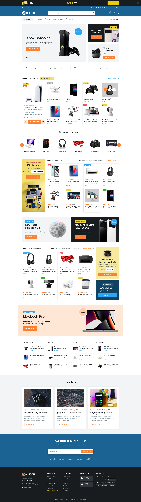

# CLICON

Fullstack MERN App using React EXPRESS Node TypeScript Jest and MongoDB



## Stack

- Dev
- Node
- TypeScript
- Mongoose
- MongoDB
- Redux

- Test
  - Jest

## Execute the App

```sh
$ npm install
$ npm start
```

## Test the App

```sh
$ npm run test
```
